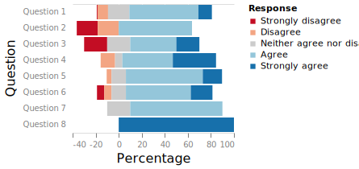

<!--
class: slides
--->

# Kroki.ioで描画した図表
## オンラインエディタ生成URLを直接埋込み

- 左はPlantUMLの例
- Krokiは、これ以外にも20以上の図表生成ツールに対応している
- **代表例:**
    - Mermaid
    - Graphviz
    - BlockDiagなど

---
# Draw.ioで描画した図表
## VS CodeプラグインでSVGをオフライン編集し、そのまま使う

---
# Vegaのグラフを使う
## VS CodeのVegaプラグインで生成したSVGを表示

---